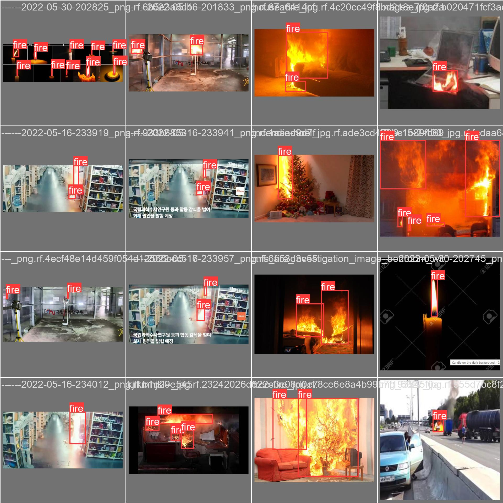

# 🔥 Fire Detection and Alert System using YOLOv5

This project presents a **real-time, low-cost, and reliable fire detection and alert system** based on computer vision, designed to run on **embedded devices** such as the Raspberry Pi 4. The system uses **YOLOv5n**, a lightweight object detection model, to detect fire in live video streams and trigger alerts through sound, light, and SMS notifications.

---

## 📌 Objectives

- Develop an **automatic fire detection system** using computer vision.
- Optimize the system for **low-power embedded hardware**.
- Integrate **real-time alert mechanisms**: buzzer, LED, and SMS notifications.

---

## ⚙️ Key Features

- 🔍 **Fire Detection** using YOLOv5n (optimized version for edge devices).
- 🎥 Supports both **live webcam feeds** and **pre-recorded videos**.
- 🔔 **Audible Alerts** via buzzer.
- 🔴 **Visual Alerts** via red LED.
- 📲 **Remote SMS Notifications** using the Infobip API.
- ⚡ Efficient model quantization (INT8 ONNX format) for fast inference on Raspberry Pi 4.

---

## 🧠 Contributions

1. **Custom Dataset** preparation tailored for fire detection.
2. **Training and Optimization** of the YOLOv5n model.
3. **Deployment on Raspberry Pi 4** with minimal latency.
4. **Integration of Alert Mechanisms**:
   - GPIO-controlled buzzer and LED.
   - SMS API integration via Infobip.

---


##📊 Results and Evaluation
The proposed system was evaluated using a custom annotated dataset collected from various online sources. The training and quantization of the YOLOv5n model yielded the following results:


mAP@0.5: 91%

Precision: 87.8%

Recall: 84.2%

Quantized Model Size: 7.2 MB (from original 27 MB)

These metrics demonstrate that the system is capable of accurately detecting fire with a low false positive rate, while being sufficiently lightweight for deployment on resource-constrained embedded platforms like the Raspberry Pi 4.

In particular:

The quantized ONNX model (INT8) maintains a high accuracy with minimal loss in performance, proving its suitability for real-time embedded applications.

Comparison to related works:

Ma et al.: mAP 74%

Yar et al.: mAP 92.2%

Our model: mAP 91%, offering a strong trade-off between model size and accuracy.

Unlike heavier models with complex components (e.g., SepViT or Transformer-based backbones), our architecture remains simple and optimized, with minimal hardware requirements.

### 1. Clone the repository

```bash
git clone https://github.com/btissammkouka/fire_detection.git
cd fire_detection
# fire_detection
# fire_detection
# fire_detection
# fire_detection
